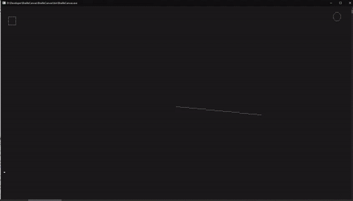

# BrailleCanvas

Draws graphics in the terminal using braille "dot-matrix" characters

### Features
* Supports **Linux** (VT100 terminals) and **Windows**
* **Coloring** of background and foreground
* Multiple **shapes**: circles, lines, rectangles
* Contour stroke and filling
* No dependencies
